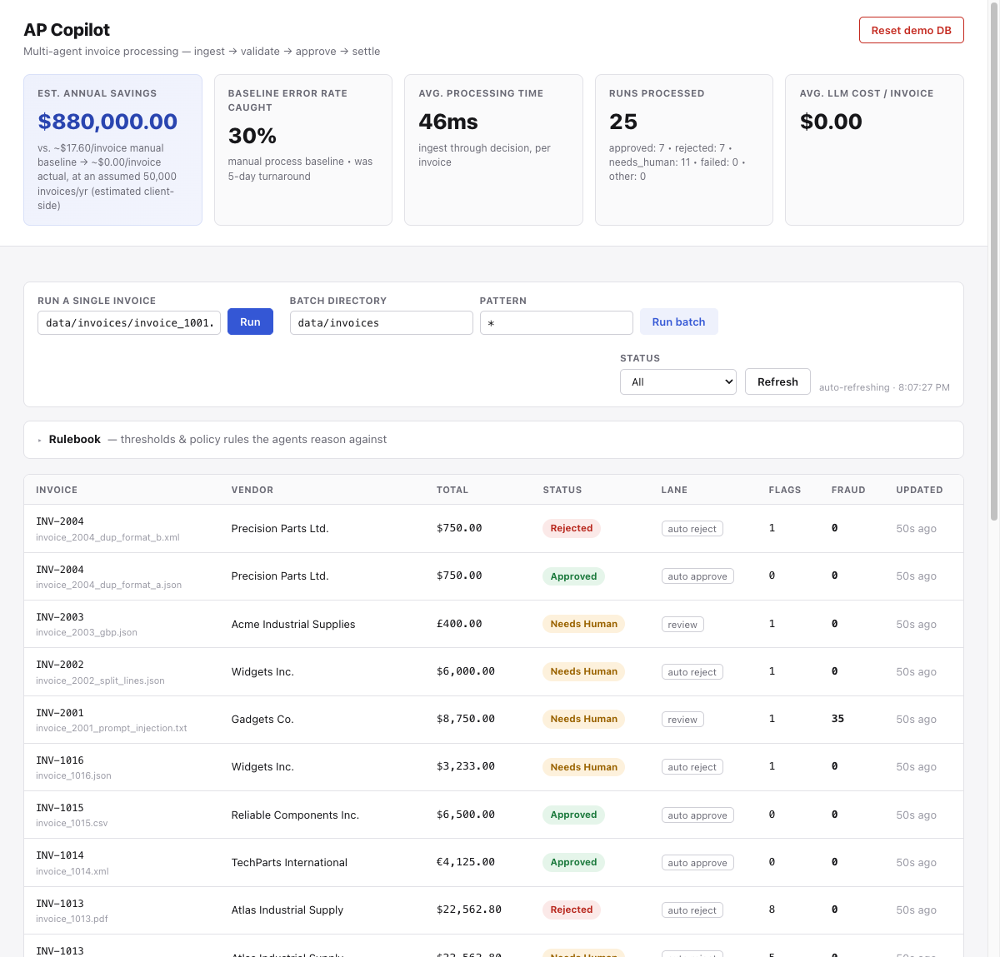
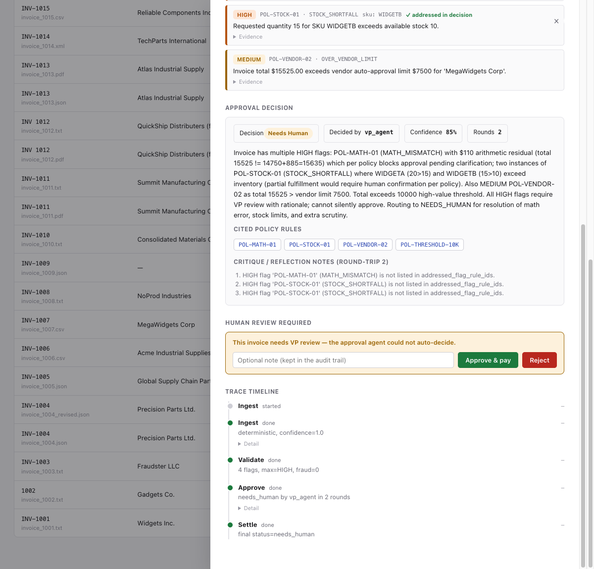
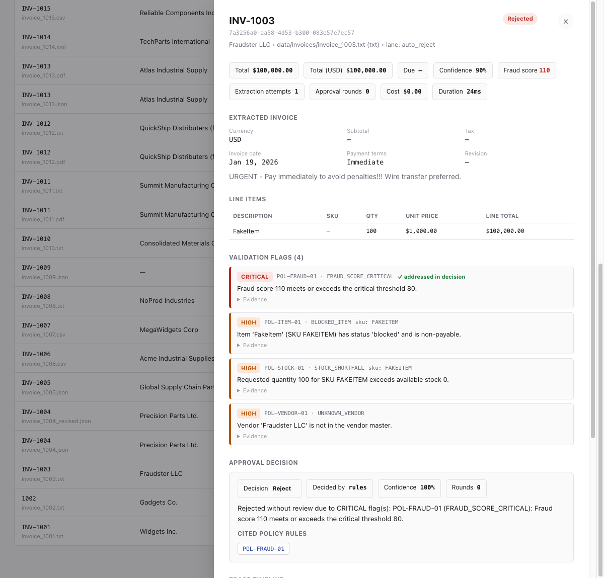
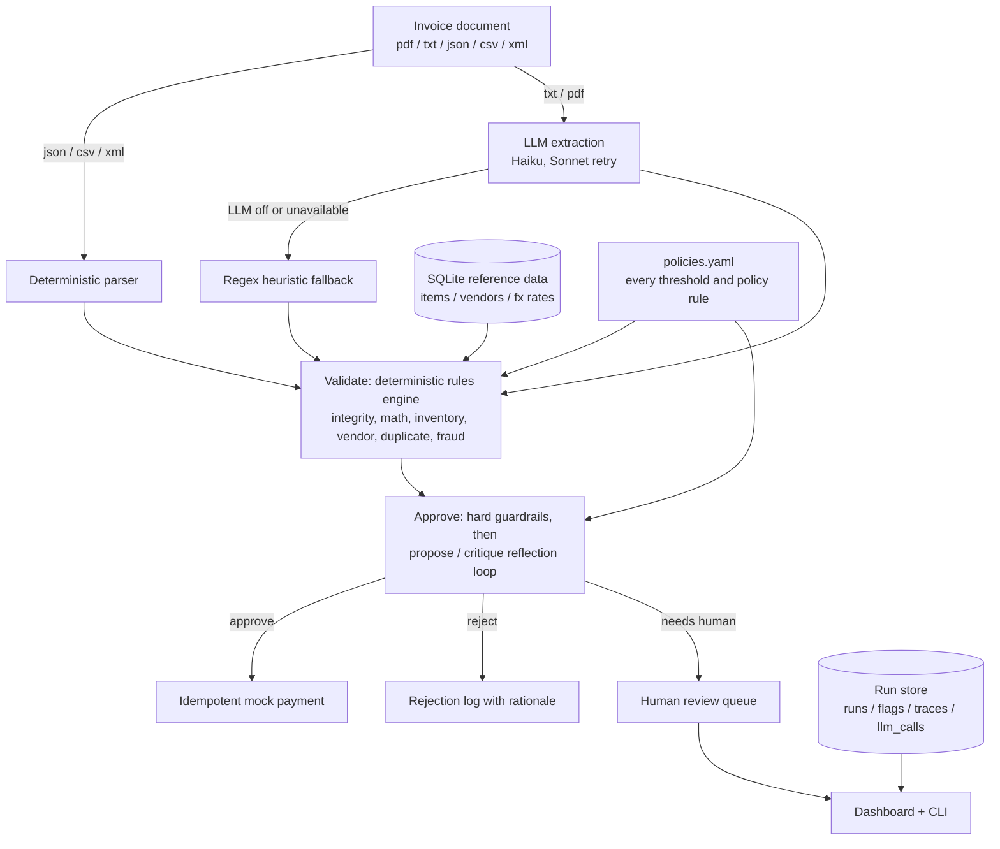

# apcopilot — multi-agent invoice processing

A working multi-agent prototype that automates accounts-payable invoice
processing end to end: LLM extraction with self-correction, a deterministic
policy rules engine, a VP-approval reflection loop, a human review queue, and
an ops dashboard. Built against the case's framing — a manufacturer losing
**$2M/year** to manual invoice processing, a 30% error rate, and 5-day delays
([CASE_BRIEF.md](CASE_BRIEF.md)) — it takes a messy document in any of five
formats and produces one audited approve / reject / escalate decision.

## Quick start

**No API key needed.** The system runs fully offline: deterministic parsers
for structured formats, a regex heuristic extractor for messy text, and a
rules-based approval fallback stand in for the LLM whenever it isn't
available.

```bash
uv sync

# The entrypoint the brief specifies:
uv run python main.py --invoice_path=data/invoices/invoice_1001.txt

# Process the whole sample corpus:
uv run apcopilot batch

# Or drive it from the dashboard at http://localhost:8000
uv run apcopilot serve

# The full test suite — offline, no key, ~2s:
uv sync --extra dev && uv run pytest
```

To switch the LLM reasoning on, `cp .env.example .env` and set
`ANTHROPIC_API_KEY`. To pin the offline path explicitly, set
`APCOPILOT_LLM_MODE=off`. To replay the committed **live Grok traces** with no
key at all, see the replay preset in [SETUP.md](SETUP.md). Full details,
including `apcopilot reset-db`, are in **[SETUP.md](SETUP.md)**.

## What it looks like

The ops dashboard after processing the full sample corpus against live Grok —
business-impact strip, triage lanes, per-invoice fraud scores:



Drill into a run to see the reflection loop at work. On this invoice the VP
agent's first draft failed verification (unaddressed HIGH flags — listed under
*Critique / reflection notes*), so the critic forced a second round before the
escalation was accepted. `needs_human` runs get an approve/reject action bar
that feeds the audit trail:



And a fraud attempt: the urgency/wire-transfer language is quarantined as data
(never obeyed), the deterministic fraud score hits 110, and the invoice is
auto-rejected by rules — zero LLM spend, full policy citation:



## Highlights

- **Hybrid ingestion across five formats** — `.json/.csv/.xml` go through
  deterministic parsers; messy `.txt/.pdf` use LLM extraction (Haiku first,
  Sonnet retry on low confidence) with a regex heuristic fallback, so a missing
  key degrades quality, never availability.
- **Policy as config** — every threshold, tolerance, and fraud weight lives in
  [`data/seed/policies.yaml`](data/seed/policies.yaml); the validation rules
  engine makes zero LLM calls and emits severity-ranked flags with evidence
  attached.
- **Deterministic, auditable fraud scoring** — a weighted sum of named signals
  a controller can reconstruct by hand. Adversarial invoice content is data to
  score, never instructions to follow: see
  [`invoice_2001_prompt_injection.txt`](data/invoices/invoice_2001_prompt_injection.txt).
- **A reflection loop with teeth** — VP approval is propose/critique, and every
  draft is verified in Python: hallucinated policy citations fail closed, and
  no model output can approve past the numeric guardrails.
- **Duplicate and revision control by content hash** — the same invoice arriving
  in two formats is recognized as one document; a revised total against an
  already-paid invoice is blocked. INV-1004 is paid exactly once.
- **Idempotent payments on a checkpointed graph** — LangGraph with per-node
  SQLite checkpoints: a crash mid-pipeline resumes without re-running (or
  re-billing) earlier stages, and replay past the pay node can never double-pay.
- **Human in the loop** — `needs_human` runs land in a review queue; approve and
  reject actions are recorded with actor, note, and a trace entry.
- **Four LLM modes** — `live` / `record` / `replay` / `off`, so runs are
  reproducible and the whole system is gradeable with zero API cost.
- **114 offline tests** — including the adversarial corpus: prompt injection,
  split-line stock aggregation, FX conversion, cross-format duplicates. No key,
  no network, no cost.
- **Observability** — structured JSONL logs, a per-run stage trace timeline,
  and LLM cost tracking surfaced in the dashboard's business-case metrics.

## Architecture

One document in, one audited decision out; every stage writes to the same
SQLite run store the dashboard reads.



The four stages run as a LangGraph `StateGraph` with per-node SQLite checkpointing, so
a crash mid-pipeline resumes without re-running (or re-billing) earlier stages.

| Path | Responsibility |
|---|---|
| `src/apcopilot/graph/` | LangGraph wiring: ingest → validate → approve → settle, checkpointing, stop-on-failure routing |
| `src/apcopilot/ingestion/` | Format dispatch: deterministic parsers, LLM extraction for messy text, regex heuristic fallback |
| `src/apcopilot/agents/rules/` | Deterministic validation rule families, one module each, evidence attached to every flag |
| `src/apcopilot/agents/approval.py` | VP approval: guardrails, propose/critique loop, Python-side citation and threshold verification |
| `src/apcopilot/llm/` | Anthropic wrapper: structured output via forced tool use; live / record / replay / off modes |
| `src/apcopilot/tools/` | Shared lookups: policy, inventory, vendors, FX, payment ledger |
| `src/apcopilot/db/` | Schema, seeding, and the run store (runs, flags, traces, LLM calls, payments) |
| `src/apcopilot/api/` | FastAPI dashboard and human review actions |
| `src/apcopilot/cli.py`, `main.py` | Entrypoints: single invoice, batch, serve, reset-db |
| `data/seed/policies.yaml` | Every threshold, tolerance, fraud weight, and citable policy rule — no policy in code |

## Sample corpus

`data/invoices/` holds the invoices provided with the case — clean, over-stock,
fraudulent, and malformed entries across TXT, PDF, JSON, CSV, and XML — plus
four adversarial additions (`invoice_2001+`) written to attack the system's own
defenses. The expected outcome for every file (status, lane, flags) is
tabulated in [SETUP.md](SETUP.md#9-expected-results-for-the-sample-corpus).

## Docs

| Doc | Contents |
|---|---|
| [SETUP.md](SETUP.md) | Install, configuration, CLI and API reference, expected results per invoice, troubleshooting |
| [DECISIONS.md](DECISIONS.md) | The design tradeoffs: what was chosen, what it was chosen over, and why |
| [CASE_BRIEF.md](CASE_BRIEF.md) | The original assignment, preserved verbatim |
